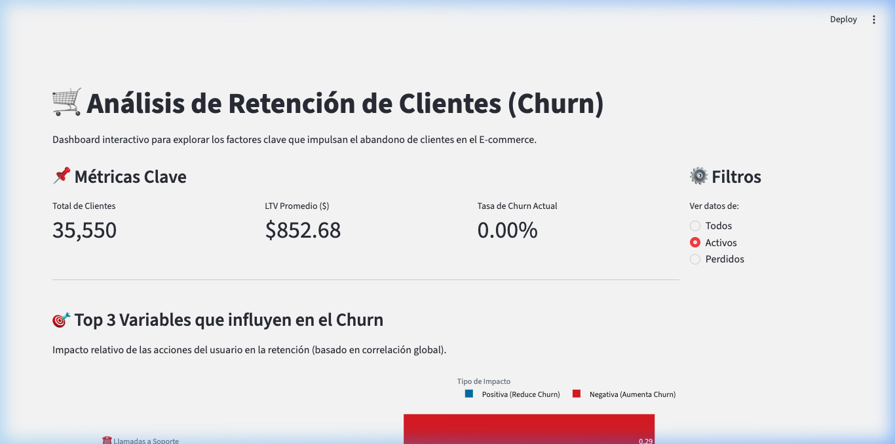

# 🛒 KCE E-commerce Customer Churn Dashboard



## 📖 Descripción del Proyecto

Este proyecto consiste en un **Dashboard Interactivo** desarrollado en Python con **Streamlit** y **Plotly** para analizar y predecir el comportamiento de retención de clientes (Churn) en una plataforma de E-commerce.

El objetivo principal de esta herramienta es proponer una vista clara y estratégica para perfiles de negocio, resaltando qué factores y comportamientos de los usuarios están más correlacionados con el abandono de la plataforma, y cuál es el impacto económico (Lifetime Value) de retenerlos frente a perderlos.

## ✨ Características Principales

- **Métricas Clave en Tiempo Real:** Visualización del volumen de clientes analizados, el Lifetime Value histórico promedio y la Tasa de Churn.
- **Análisis de Impacto (Z-Pattern):** Gráficos horizontales interactivos destacando el Top 3 de variables que más aumentan o disminuyen el riesgo de abandono (Customer Service Calls, Cart Abandonment Rate, Pages Per Session).
- **Inferencia de LTV:** Boxplot comparativo del valor de vida del cliente entre segmentos Activos y Perdidos.
- **Filtros Interactivos:** Segmentación completa de todos los gráficos y métricas según el estado actual del cliente.
- **Diseño Adaptable:** Interfaz corporativa limpia que soporta tanto modo claro como modo oscuro nativo de Streamlit.

---

## 🏗️ Arquitectura de Software Límpio (Clean Code)

A diferencia de muchos proyectos analíticos monolíticos, este dashboard ha sido estructurado siguiendo principios de separación de responsabilidades (SRP - Single Responsibility Principle):

```text
KCE-E-commerce-Customer-Churn/
├── data/
│   └── ecommerce_customer_churn_dataset.csv  # Dataset en su ubicación segura y aislada
├── docs/
│   └── dashboard_preview.png                 # Capturas y recursos multimedia
├── notebooks/
│   └── ecommerce_customer_churn_dataset.ipynb # Cuaderno de EDA y limpieza inicial de datos
├── src/
│   ├── __init__.py
│   ├── config.py                             # Capa de Configuración: Setup de página y estilos CSS
│   ├── data_processor.py                     # Capa de Datos: ETL, Inverse Scaling y manejo de Nulos
│   └── ui_components.py                      # Capa UI: Gráficos Plotly, KPIs y Layouts modularizados
├── app.py                                    # Entry-point (Orquestador ligero)
└── requirements.txt                          # Dependencias del entorno
```

---

## 🚀 Instalación y Ejecución

Sigue estos pasos para ejecutar el dashboard localmente en tu máquina.

### 1. Clonar el repositorio
```bash
git clone <URL_DEL_REPOSITORIO>
cd KCE-E-commerce-Customer-Churn
```

### 2. Crear un entorno virtual (Recomendado)
```bash
python -m venv venv
source venv/bin/activate  # En macOS/Linux
# o bien: venv\Scripts\activate  (En Windows)
```

### 3. Instalar las dependencias
Todas las librerías requeridas se encuentran en el archivo `requirements.txt`.
```bash
pip install -r requirements.txt
```

### 4. Lanzar la aplicación
Asegúrate de ejecutar el comando desde la raíz del proyecto, donde se encuentra `app.py`.
```bash
streamlit run app.py
```

El dashboard se abrirá automáticamente en tu navegador predeterminado bajo la dirección `http://localhost:8501`.

---

## 📊 Origen y Tratamiento de los Datos

El proyecto se divide en dos fases de datos principales:

### 1. Limpieza y Exploración Inicial (EDA)
Todo el trabajo de preparación primario (manejo de variables categóricas complejas, imputaciones iniciales y escalado general con `StandardScaler` para futuros modelos predictivos) se llevó a cabo en Jupyter Notebook. 
El archivo con esta experimentación vive en: `notebooks/ecommerce_customer_churn_dataset.ipynb`. Este cuaderno es la base matemática sobre la cual el dashboard opera.

### 2. Transformación para Negocio (Dashboarding)
El archivo `ecommerce_customer_churn_dataset.csv` (resultado del cuaderno) alimenta la visualización. Dado que este dataset terminó con variables estandarizadas, el módulo `data_processor.py` realiza un proceso de **Transformación Inversa (Des-escalado)** en tiempo real. Esto devuelve métricas como el dinero gastado y el número de llamadas a valores humanos e interpretables (ej. $850 USD o 2 llamadas) en vez de puntajes *Z-Scores* abstractos, haciéndolo ideal para la toma de decisiones gerenciales.

---
**Desarrollado con 💙 utilizando Python, Pandas y Streamlit.**
